# Welcome to ClinicMate!
*Your solution to streamlining patient contact management.*

Greetings to esteemed healthcare professionals! Are you still grappling with traditional methods to manage patient details and jot down doctor's notes on paper? Are you overwhelmed by the challenge of organizing all your clinic's patient data?

Fret not! **ClinicMate** is your solution.

ClinicMate is tailor-made to streamline contact management in your clinic. Whether you're a seasoned practitioner or just starting out, ClinicMate is your indispensable companion.

This comprehensive user guide will effortlessly navigate you through ClinicMate's array of features, ensuring optimal efficiency in managing patient contacts.

Here is a **quick overview** of how ClinicMate streamlines contact management:

**Data Management Functions**:
- ***Navigation and Assistance Functions***: Reset the interface using `clear`, access comprehensive guidance through `help`, and `exit` ClinicMate with ease. 

- ***Data Management Functions***: Easily input, modify, and remove patient details through `add`, `edit` and `delete`. View detailed a comprehensive lists of patient information effortlessly with `lists` and `show` command. Effortlessly search for specific patient records with `find`.

- ***Note-Taking Function***: Use `addnote` to quickly append relevant notes to patient records for future reference.

ClinicMate is a desktop application featuring a **Command Line Interface (CLI)** with the convenience of a Graphical User Interface (GUI). Whether you're adept at typing or prefer a visual interface, ClinicMate ensures **swift and efficient** management of patient contacts.

Bid farewell to cumbersome paperwork and embrace the efficiency of ClinicMate in organizing your clinic's patient data.

<!-- * Table of Contents -->
<page-nav-print />

# Guide Usage

Welcome to the comprehensive user guide for ClinicMate! Our goal is to provide you with the knowledge and tools necessary to make the most of ClinicMate, your essential tool for clinic management. Whether you're a beginner or an experienced user, we're here to support you every step of the way.

Before we dive into the details, let's acquaint ourselves with the annotations you'll encounter throughout this user guide. These annotations will help you understand and navigate ClinicMate's features smoothly.

**:bulb: Useful Tip:** 

- Provides additional insights and tips to enhance your ClinicMate experience.

**:memo: Note:** 
- Provides valuable additional details for using ClinicMate effectively.

**:warning: Warning:** 
- Alerts you to potential pitfalls or issues to be mindful of when using ClinicMate.

 

Throughout this guide, you'll also encounter various text styles. Here's what they represent:

- _Used to illustrate possible scenarios for utilizing a feature (mostly in feature sections)._
- [Represents hyperlinks that you can click to navigate to another section of this user guide or to an external website.]()
- `Highlights specific elements such as file names, commands, or any text that should be treated as code.`
- > Provides information about the parameters that you can input into a command.

Now that you're familiar with the annotations and text styles, we will give you a tour on how to navigate this user guide based on your level of expertise.

## Quick start

In this section, you will learn how to set up ClinicMate on your computer. 

### Prerequisites

1. Open Command Prompt (for Windows) or Terminal (for MacOS and Linux) on your desktop.
2. Run the command `java -version` to check if you have Java 11 or above installed in your computer.
* Assuming that you have Java installed in your computer,
  * If you have a Windows, in this case the Java version is 19.0.2.
     
  
  * If you have a Mac,  in this case the Java version is 11.0.19.
     

3. If you do not have Java 11 or above installed in your computer, download it from [here](https://www.oracle.com/java/technologies/javase-jdk11-downloads.html).

### Setting up
1. Download the latest `.jar` file [here](https://github.com/AY2324S2-CS2103T-F14-2/tp/releases/latest)
2. You will see this screen after clicking on the link above.
   * Click on the `clinicmate.jar` file to download it.

3. Move the file to the folder you want to use as the _home folder_ for your ClinicMate.
   * For example, if you want to use the `Documents` folder as the _home folder_ for your ClinicMate, create a new folder named `clinicmate` in the `Documents` folder.
   * You can then move the `.jar` file to a folder named `clinicmate` in your `Documents` folder.
   

### Running the application
1. Open Command Prompt (for Windows) or Terminal (for MacOS and Linux) on your desktop.
2. Run the `cd` command into the folder you put the jar file in.
   * `cd` is the command to change directory.
   * e.g. `cd Documents/clinicmate`
3. Run the `java -jar clinicmate.jar` command to run the application. 
4. Your command terminal should look like this after steps 2 and 3.
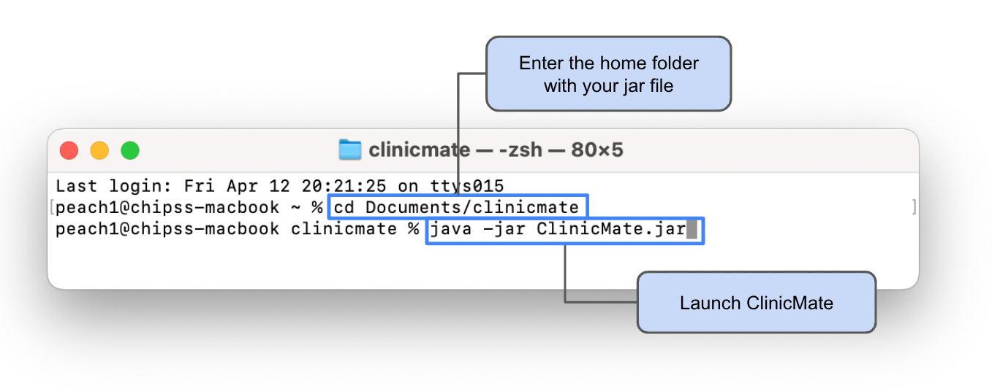

**:warning: Warning:** 
- You may notice that a new folder named `data` is newly created. This folder contains the data file for ClinicMate.
- Do not delete this folder or its contents as it contains your patient data.

5. You should see the following screen after running the command.

6. Great job! You have successfully set up ClinicMate on your computer. You are now ready to learn about the **GUI** of ClinicMate!

--------------------------------------------------------------------------------------------------------------------

## GUI Overview

ClinicMate features a Graphical User Interface (GUI) that provides a seamless user experience. The GUI is designed to be intuitive and user-friendly, allowing you to navigate through the application effortlessly.

The GUI consists of the following components:

| **Number** | **Component**       | **Description**                                              |
|------------|---------------------|--------------------------------------------------------------|
| 1          | Command Box         | Enter commands here to interact with ClinicMate.             |
| 2          | Message Box         | Displays the output of commands executed in the Command Box. |
| 3          | Patient List Panel  | Displays the list of patients in ClinicMate.                 |
| 4          | Patient Notes Panel | Displays the notes of the patient that you are viewing.      |

**:bulb: Useful Tip:** 

- To maximise your viewing experience, opt for full-screen mode in ClinicMate!

Now that you have been introduced to the GUI components, let's proceed to learn how you can use the CLI to interact with ClinicMate.

## CLI Overview
Experience the seamless power of ClinicMate's Command Line Interface (CLI) - where interaction is as simple as typing commands. 
Say goodbye to juggling between typing and clicking, and welcome the streamlined efficiency of CLI!

CLI is straightforward to use. The Command Box acts as your entry point for commands. Once you hit enter, ClinicMate processes 
your input and delivers responses through the Message Box. It's all about interacting with ClinicMate effortlessly through text.

Ready to dive in? Let's explore writing command lines and get you started with ClinicMate!

## Command Format

To use our CLI, here is an overview of the command formats. 

| **Component** | **Example** | **Description**                                                                                                      |
|---------------|-------------|----------------------------------------------------------------------------------------------------------------------|
| Command       | `add`       | Represents the action that you want to perform.                                                                      |
| Parameter     | `Mary`      | Represents a value that replaces the `UPPER_CASE` placeholders in the command format.                                |
| Prefix        | `n\ `       | Represents the type of parameter to be edited.                                                                       |
| Flag          | `-replace`  | Represents an additional parameter that modifies the command's behavior. Must be used at the end of the command. |

You can find all the parameters used in ClinicMate [here](#definitions-of-key-terms). To learn more about the prefixes and command words used in ClinicMate, 
you can refer to the [Command Summary Section](#command-summary).

Let's see how these components are used in a command!

### Example Command: `addnote`

You can substitute specific parameter values into the parameters in the command format. For instance, in the `addnote` command, you can replace `IC_NUMBER` with the patient's IC number and `NOTE` with the note you want to add.

But what about the `[]` around `-replace`? Here's more about it:

| **Symbol** | **Description**                                    | **Example**   |**Meaning**|
|------------|----------------------------------------------------|---------------|-----------|
| `[]`       | Indicates an optional parameter                    | `[-replace]`  | The `-replace` flag is optional and can be included or excluded in the command. |
| None | Indicates a mandatory parameter | `n\NOTE` | The `n\NOTE` parameter is mandatory and must be included in the command. |

--------------------------------------------------------------------------------------------------------------------

# Existing Features
This section gives you a step-by-step guide on how to use ClinicMate's feature. The 3 categories of ClinicMate's features are as follows:
- ***Navigation and Assistance Functions***: `clear`, `help`, `exit`

- ***Data Management Functions***:  `add`, `edit`, `delete`, `show`, `find`,list

- ***Note-Taking Function***: `addnote` 

**:memo: Note:** 

* Words in `UPPER_CASE` are the parameters to be supplied by the user. 
  e.g. in `add n\NAME`, `NAME` is a parameter which can be used as `add n\John Doe`.

* Parameters with a prefix can be in any order. 
  e.g. if the command specifies `n\NAME i\IC_NUMBER`, `i\IC_NUMBER n\NAME` is also acceptable.

* Extraneous parameters for commands that do not take in parameters (such as `help`, `list`, `exit` and `clear`) will be ignored. 
  e.g. if the command specifies `help 123`, it will be interpreted as `help`.

* If you are using a PDF version of this document, be careful when copying and pasting commands that span multiple lines as space characters surrounding line-breaks may be omitted when copied over to the application.

## Navigation and Assistance Functions
Navigation and Assistance Functions in ClinicMate serve to enhance user experience and streamline workflows within the clinic management software. 

### Viewing help : `help`
*Encountering a roadblock in ClinicMate? No problem! Simply utilize the `help` command for immediate assistance and guidance.*

**Format**: `help`

**Steps**:
1. Enter `help` into the command box. A help window should pop up.
2. You can access help by either:
- Copying our User Guide's link through the **Copy URL** button.
- Directing accessing our website through pressing on the icon.

### Clearing all entries : `clear`
*Transitioning to a new clinic? Easily clear existing data from ClinicMate with a simple `clear` command!*

**Format**: `clear`

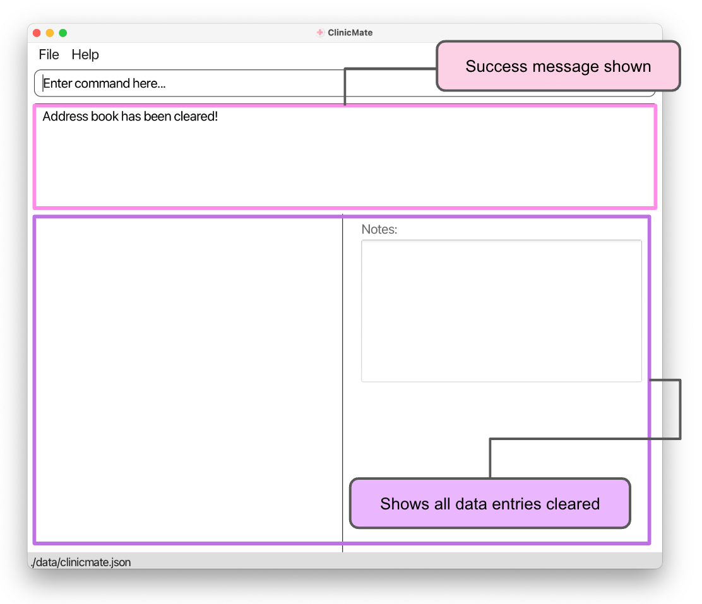

**Steps**:
1. Enter `clear` into the command box. All entries will then be cleared.

**:warning: Warning:** 
`clear` is a one-time deletion of all of your entries in ClinicMate. Please use it with consideration and care. You will not be able to retrieve any information back once command has been called.

 

### Exiting the program : `exit`

*Concluding your session? Simply use the `exit` command to gracefully exit the program and conclude your session.*

*Format*: `exit`

*Steps*:
1. Enter `exit` into the command box. You will then be directed out of ClinicMate.

**:memo: Note:** 

Don't worry about losing your data when exiting. They will be automatically saved!

## Data Management Functions ##
### Adding a person: `add`
*Encounter a new patient without a record? No worries! Our `add command` simplifies the process of swiftly adding their details to ClinicMate.*

Format: `add n\NAME p\PHONE e\EMAIL i\IC_NUMBER ag\AGE s\SEX a\ADDRESS`

Steps:
1. Enter `add n\NAME p\PHONE e\EMAIL i\IC_NUMBER ag\AGE s\SEX a\ADDRESS` into the command box. 
2. New entry with particulars of `n\NAME p\PHONE e\EMAIL i\IC_NUMBER ag\AGE s\SEX a\ADDRESS` is added.

**:memo: Note:** 

* Parameters can be in any order
* A person will be uniquely identified by his/her personal identification number.
* ClinicMate does not allow the same identification number to be used twice.
* A name can have the special characters `-`, `,`, `/` in it.

Examples:
* `add n\John Doe p\88888888 e\johndoe@mail.com i\T0123456A ag\12 s\M a\John street, block 123, #01-01`

What a successful `add` command looks like:
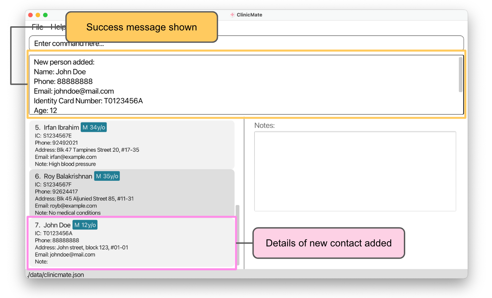

**:bulb: Useful Tip:** 

A person can have a note included (See [addnote](#adding-a-note--addnote) command).

**Possible Errors that you might encounter:**

You might encounter error messages due to the lack of familiarity with the application. There is no need to panic as our error messages will tell you how you can solve them!
An example is shown below:
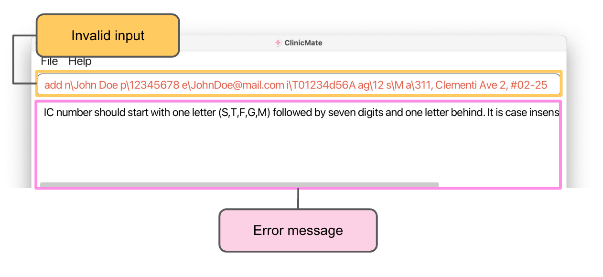

### Listing all entries : `list`
*Looking for a comprehensive overview of your patient entries in ClinicMate? Utilize the `list` command for quick access to all your patient records.*

Format: `list`

Steps:
1. Enter `list` into the command box. All of your patient details will then be displayed.

### Locating persons by IC number: `find`
*Today, your regular patient arrives at the clinic, and you need to retrieve her record. However, with a multitude of contacts, locating hers seems daunting. Fear not! Utilize the find command to swiftly pinpoint the specific patient you're searching for using their `IC_NUMBER`.*

> ClinicMate will display their contact information on the left-hand side of the screen and their full notes on the right-hand side, for a more comprehensive view.

Format: `find IC_NUMBER`

Steps:
1. Enter `find IC_NUMBER` into the command box.
2. The patient record with the corresponding `IC_NUMBER` will be retrieved, with his/her notes shown in the notes panel.

**:memo: Note:** 

* Only one patient record will be retrieved at any one time.
* Finds the person with the specified `IC_NUMBER`.
* The IC_NUMBER refers to the IC number shown in the displayed person list.
* The IC_NUMBER **must be the FULL IC NUMBER**.
* The search is case-insensitive. e.g `t0123456a` will match `T0123456A`.
* Only the IC number is searched.
* Only full IC number will be matched e.g. `T0123456A` will not match `T0123A`.

Examples:
* `find T0123456A` returns `John Doe`.

What a successful `find` command looks like:
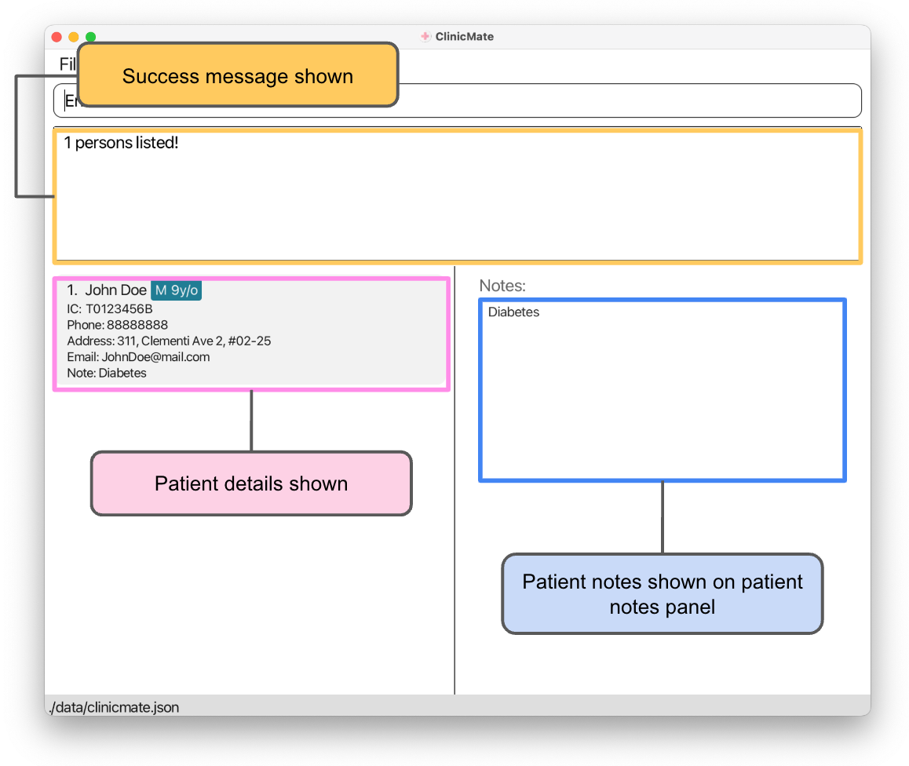

**Possible Errors that you might encounter:**

There might be cases that the `IC_NUMBER` you keyed in is invalid as shown below. Do check if the `IC_NUMBER` is in the correct format.
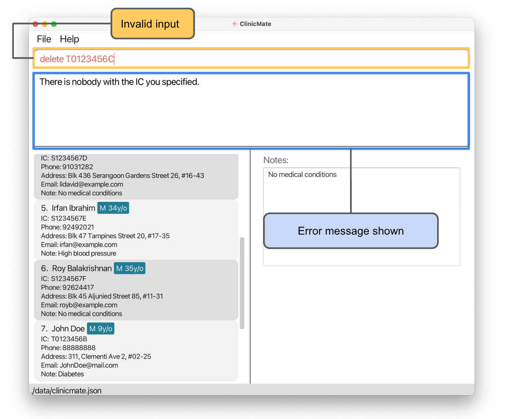

### Changing the displayed note: `show`
*Need to view the notes of another patient by adjusting the display on the right? Or perhaps you want to clear the current display altogether? Enter the `show` command for effortless management of note displays.*

*General Format*: `show [IC_NUMBER]`

#### To change display (IC_NUMBER is provided)

*Format*: `show IC_NUMBER`

*Steps*:
1. Enter `show IC_NUMBER` into the command box as shown below.

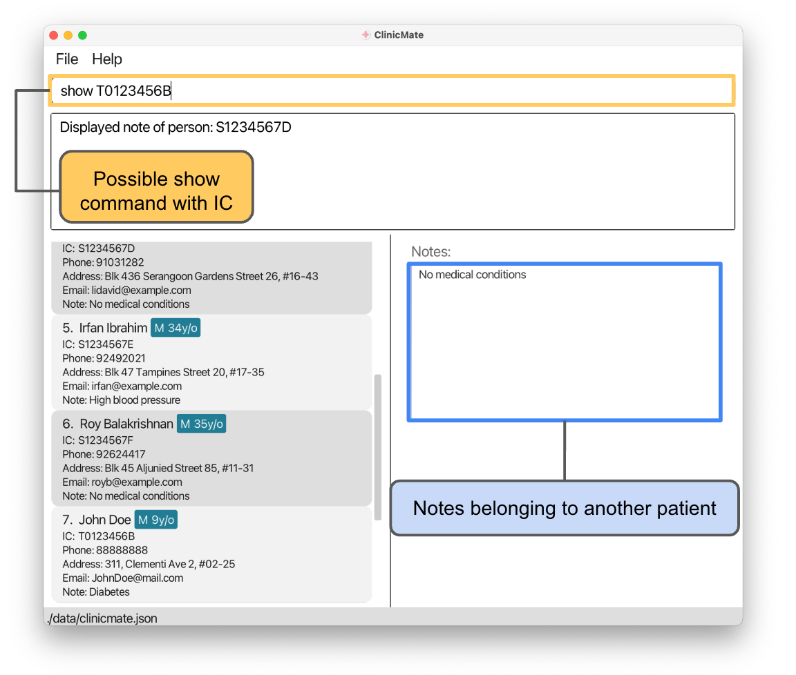

2. Notes display will be updated to the notes corresponding to the IC_NUMBER.

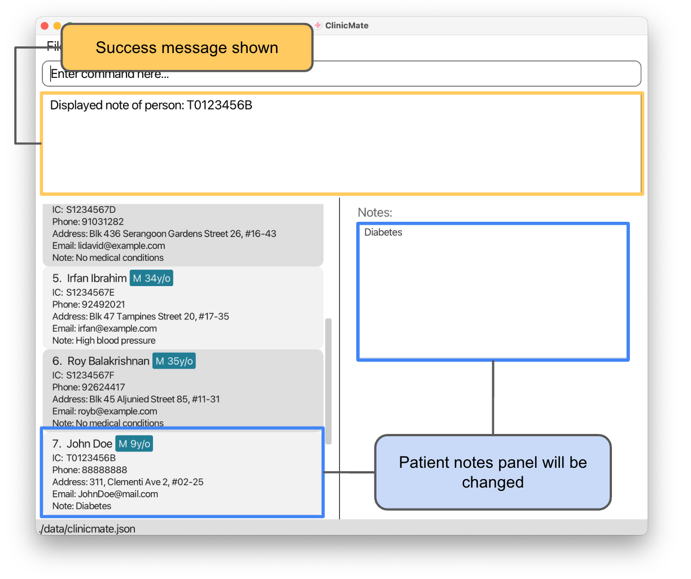

**:memo: Note:** 
* Rules for valid IC_NUMBER are the same as the `find` command.
* Displays the full note of the person with the specified IC_NUMBER.
* Does NOT modify the list of persons displayed.
 

Example:
* `show T0123456A` updates the note display on the right to show `John Doe`'s note.

#### To clear display (IC_NUMBER is not provided)

*Format*: `show`

*Steps*:
1. Enter `show` into the command box as shown below.

2. Notes display will be cleared.

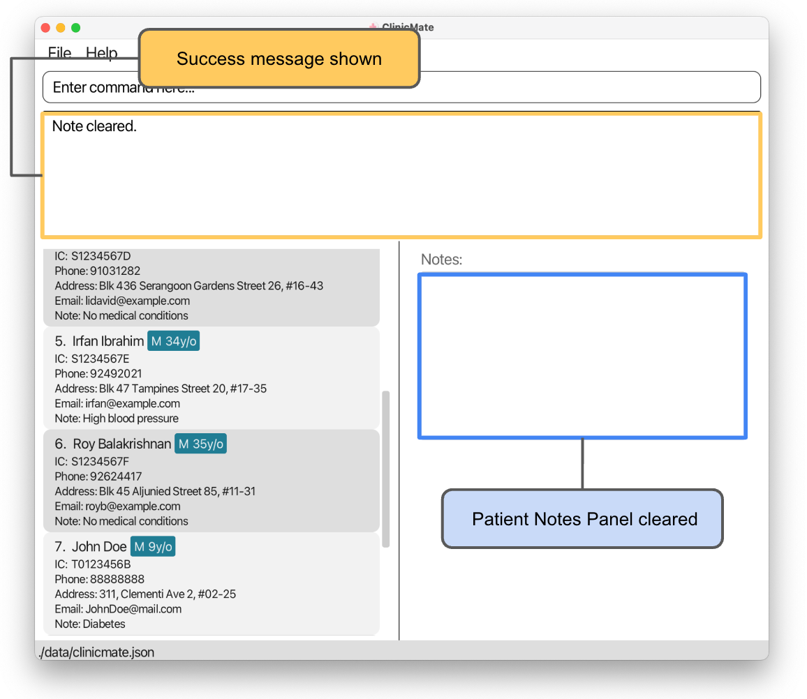

**:memo: Note:** 
* Clears the note display on the left.
* Does NOT modify the list of persons displayed.

Example:
* `show` clears any note that was being displayed on the right.

**Possible Errors that you might encounter:**
Refer to `find`.

### Editing a person : `edit`
Made a typo in a detail? Don't worry! The `edit` command is here to assist you in correcting any mistakes effortlessly using the patients' `IC_NUMBER`.

Format: `edit IC_NUMBER [n\NAME] [p\PHONE] [e\EMAIL] [i\IC_NUMBER] [ag\AGE] [s\SEX] [a\ADDRESS]`

**:bulb: Useful Tip:** 

Optional fields are indicated by square brackets `[]`.

Steps:
1. Enter `edit IC_NUMBER [n\NAME] [p\PHONE] [e\EMAIL] [i\IC_NUMBER] [ag\AGE] [s\SEX] [a\ADDRESS]` into the command box.
2. The patient record with the corresponding `IC_NUMBER` will be edited.

**:memo: Note:** 

* Edits the details of the person with the specified `IC_NUMBER`.
* The fields to be edited are indicated by the prefixes `n\`, `p\`, `e\`, `i\`, `ag\`, `s\`, `a\`.
* Only the fields that are provided will be updated.

Examples:
* `edit T0123456A p\88888888` edits the phone number of the person with `IC_NUMBER` of `T0123456A` to `88888888`.

What a successful `edit` message looks like:

### Deleting a person : `delete`

*The delete command enables the removal of patient records from ClinicMate. Use it to efficiently manage patient data by removing outdated or unnecessary entries.*

Format: `delete IC_NUMBER`

Steps:
1. Enter `delete IC_NUMBER` into the command box.
2. The patient record with the corresponding `IC_NUMBER` will be deleted.

**:memo: Note:** 

* Deletes the person with the specified `IC_NUMBER`.
* The IC_NUMBER refers to the IC number shown in the displayed person list.
* The IC_NUMBER **must be the FULL IC NUMBER**.
* The search is case-insensitive. e.g `t0123456a` will match `T0123456A`.
* Only the IC number is searched.
* Only full IC number will be matched e.g. `T0123456A` will not match `T0123A`.
* You can only delete one patient at any one time

Examples:
* `delete T0123456A` deletes `John Doe` who has `IC_NUMBER` of `T0123456A` from ClinicMate.

What a successful `delete` message looks like:

<<<<<<< HEAD
**Possible Errors that you might encounter:**

There might be cases that the `IC_NUMBER` you keyed in does not exist in ClinicMate as shown below. Do check if the `IC_NUMBER` is registered before before trying to delete it.

**:warning: Warning:** 

`IC_NUMBER` tend to be long. Please make sure that the `IC_NUMBER` you want to delete is correct as we would not be able to recover lost patient information once deleted.

## Note-Taking Function ##
*This feature is tailored specifically for doctors, offering seamless note-taking capabilities to enhance efficiency and precision in documentation.*

### Adding a note : `addnote`
*As doctors, it's essential to document prescriptions and notes for each patient. Simplify this process with the `addnote` command, ensuring efficient and accurate record-keeping.*

*General Format*: `addnote IC_NUMBER n\NOTE [-replace]`

#### To append notes

*Format*: `addnote IC_NUMBER n\NOTE`

*Steps*:
1.  Enter `addnote IC_NUMBER n\NOTE ` into the command box.

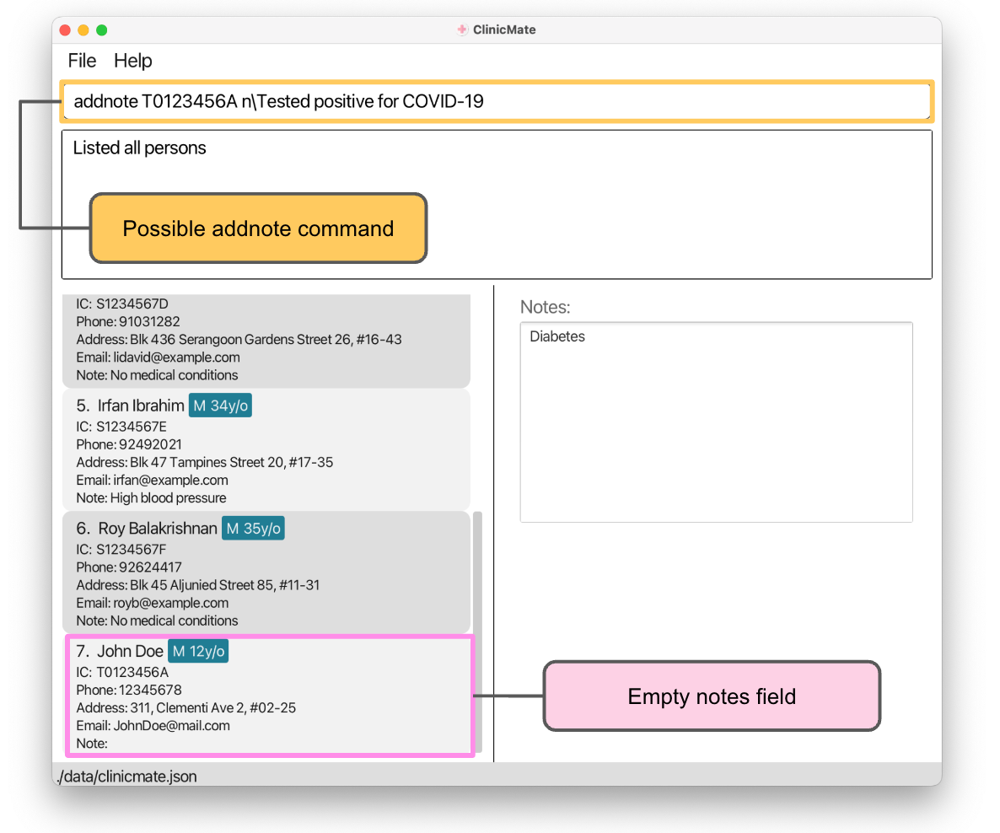

2.  System will then add a note to the person with the specifies `IC_NUMBER`.

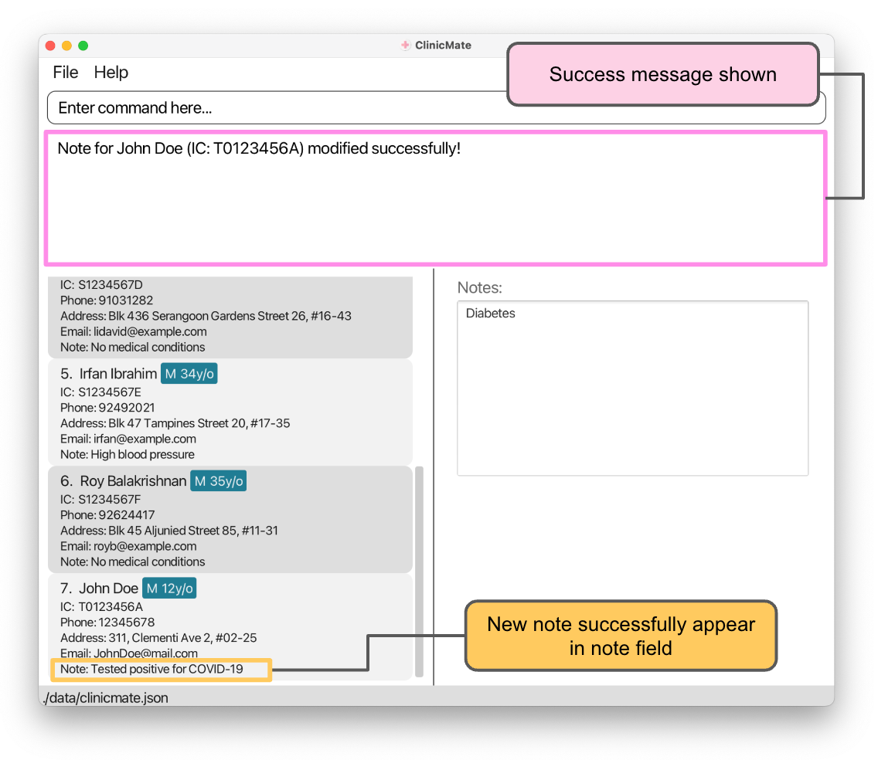

3.  New note will appear in notes field. If notes field already have existing notes, new notes will be appended to the previous notes.

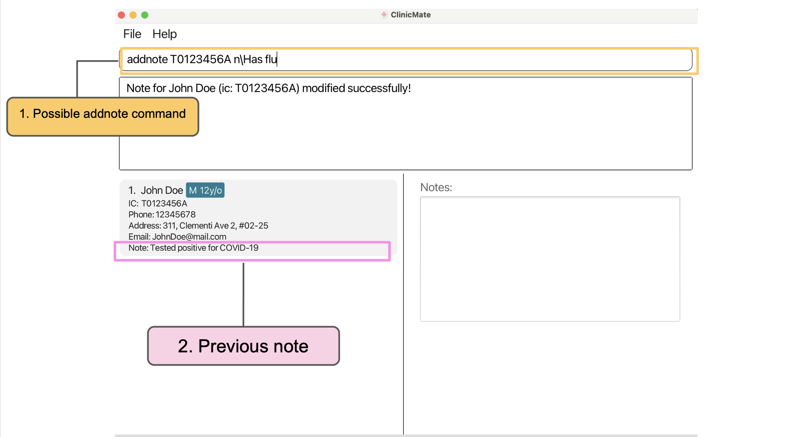

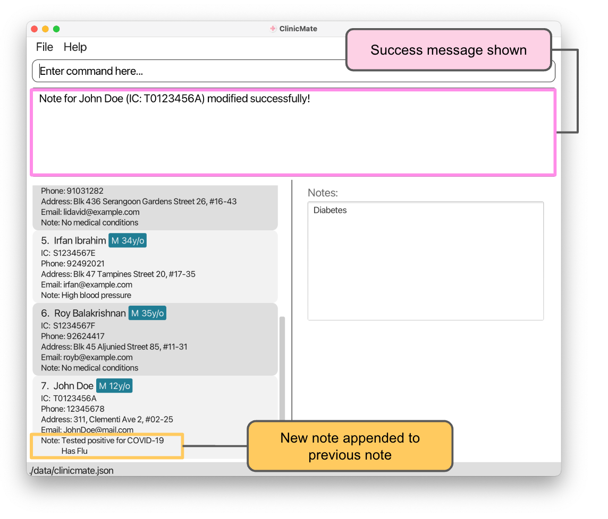

**:memo: Note:** 

* The IC number refers to the IC number shown in the displayed person list. The IC_NUMBER **must be the FULL IC NUMBER**.
* IC number must be valid and currently exist in the database.
* Existing values will be updated to the input values.
* When adding notes, the new note added will be appended to the current note of the person. i.e. current note is preserved.

#### To replace notes

*Format*: `addnote IC_NUMBER n\NOTE -replace`

*Steps*:
1.  Enter `addnote IC_NUMBER n\NOTE -replace` into the command box.

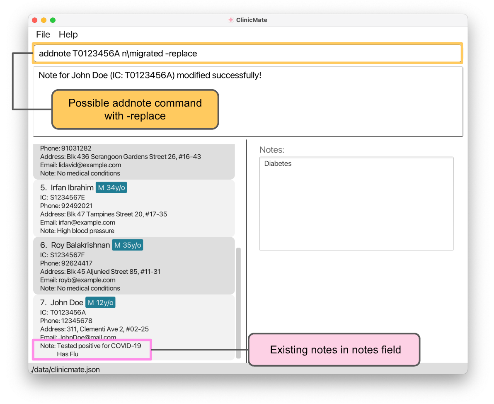

2.  System will then replace a note to the person with the specifies `IC_NUMBER`
3.  New note will replace previous note.

**:memo: Usage of `-replace` flag:** 

* It can be used to clear the existing note and replace it with the new note.
* It must only be used once.
* It must only be used at the end of the command.

Examples:
* `addnote T0123456A n\Patient has diabetes` Adds a note `Patient has diabetes` to the person with the IC number `T0123456A` in ClinicMate.
* `addnote T0123456A n\Patient has diabetes -replace` Replaces the note of the person with the IC number `T0123456A` with `Patient has diabetes`.

**:bulb: Useful Tip:** 

Users will be able to see specific patient notes on the notes section using the `show` command. (See [show](#changing-the-displayn-note--show) command)

## Data Files

### Saving the data

ClinicMate data are saved in the hard disk automatically after any command that changes the data. There is no need to save manually.

### Editing the data file

ClinicMate data are saved automatically as a JSON file `[JAR file location]/data/clinicmate.json`. Advanced users are welcome to update data directly by editing that data file.

<box type="warning" seamless>

**Caution:**
If your changes to the data file makes its format invalid, ClinicMate will discard all data and start with an empty data file at the next run.  Hence, it is recommended to take a backup of the file before editing it. 
Furthermore, certain edits can cause the ClinicMate to behave in unexpected ways (e.g., if a value entered is outside the acceptable range). Therefore, edit the data file only if you are confident that you can update it correctly.
</box>

--------------------------------------------------------------------------------------------------------------------

## FAQ

**Q**: When will my note be cleared?  
**A**: The note will be cleared when you use the `show` command without any `IC_NUMBER`. Unfortunately, `clear` or `delete` command will not clear the note. 

**Q**: When using multiple screens, moving the application to a secondary screen and later switching to using only the primary screen, the GUI opens off-screen. What do I do? 
**A**: Delete the `preferences.json` file created by the application before running the application again.

**Q**: Is there a limit to the number of patient records ClinicMate can manage? 
**A**: ClinicMate is designed to handle a large number of patient records efficiently. However, performance may vary depending on the hardware specifications of your computer and the amount of data being managed.

**Q**: How do I load my data from another Computer? 
**A**: Let's say that you want to move your data from `Computer A` to `Computer B`. You should:
1. Delete the `data.json` file that is located at `[JAR file location]/data/clinicmate.json` in `Computer B`.
2. Copy the `data.json` file from `Computer A` to `Computer B` at the same location as above.
3. Run the ClinicMate in `Computer B` to load the data.

**Q**: Can I export patient data from ClinicMate for reporting or backup purposes? 
**A**: Currently, ClinicMate does not support direct export of patient data. However, you can manually copy the data from the data file located at `[JAR file location]/data/clinicmate.json` for backup or reporting purposes.

**Q**: Can I customize the fields for patient records in ClinicMate? 
**A**: ClinicMate currently supports predefined fields for patient records (name, phone, email, IC number, age, sex, address). Customization of fields is not supported in the current version.

**Q**: How secure is the patient data stored in ClinicMate? 
**A**: ClinicMate stores patient data locally on your computer in a JSON file. It is recommended to keep your computer secure and up-to-date with the latest security patches to ensure the safety of patient data.

**Q**: Is there a way to import patient data into ClinicMate from other software? 
**A**: ClinicMate does not currently support direct import of patient data from other software. However, you can manually enter patient data using the `add` command.

--------------------------------------------------------------------------------------------------------------------
## Appendix: Planned Enhancements

1. **Support for multiple phone numbers**: Allow users to add multiple phone numbers for a single patient record.
2. **Error handling**: Improve error messages in `edit` command to check for existence of IC number in the event of empty fields.
3. **Custom fields**: Allow users to customize fields for patient records to suit their clinic's requirements.
4. **Date of Birth**: Add a field for date of birth to patient records for better age calculation.
5. **Appointment scheduling**: Implement a feature to track and schedule patient appointments.
6. **Support for patient identification**: Allow users to use other methods to identify patients, such as passport numbers, names or driving license numbers.
7. **Add Note features**: 
- Implement a feature to allow users to edit and delete specific notes. 
- Allow users to know whose note they are viewing, by displaying the patient's name or IC number.
- Implement a feature for users to have the option of hiding the notes section in the patient's profile card.

--------------------------------------------------------------------------------------------------------------------
## Glossary

### Definitions of Key Terms

These descriptions will help you understand the key terms used in ClinicMate.

| Term                 | Definition                                                                                                                                                                                                           |
|----------------------|----------------------------------------------------------------------------------------------------------------------------------------------------------------------------------------------------------------------|
| **Alphanumeric**     | Alphanumeric pertains to a character set containing both letters and numbers, encompassing the full range of 26 English alphabet letters (both uppercase and lowercase) along with numerical digits 0 through 9.     |
| **Case-insensitive** | Case-insensitive treatment equates uppercase and lowercase characters, treating them as identical. For instance, both `john` and `John` would be considered the same.                                                |
| **CLI**              | CLI, or Command-Line Interface, is a text-based interface enabling users to interact with software via typed commands.                                                                                               |
| **Command**          | A command denotes a user's directive to ClinicMate, instructing it to execute a specific action. For example, the `add` command adds the patient's details to ClinicMate.                                            |
| **GUI**              | GUI, or Graphical User Interface, facilitates user interaction with software through visual elements like icons, buttons, and windows, providing a more intuitive alternative to text-based commands.                |
| **JAR**              | JAR, short for Java Archive, represents a package file format used to bundle multiple Java class files, along with associated metadata and resources, into a single file for distribution purposes.                  |
| **JSON**             | JSON, standing for JavaScript Object Notation, serves as a lightweight data interchange format that is human-readable and easy for machines to parse, commonly utilized in web applications and configuration files. |
| **Parameter**        | A parameter resembles a field in a form that requires input. In the command `edit S1234567A ag\AGE nNAME`, `AGE` and `NAME` are parameters within the command.                                                       |
| **Prefix**           | A prefix acts as a keyword used to identify a parameter. In the command `edit S1234567A ag\AGE n\NAME`, `ag\` and `n\` function as prefixes.                                                                         |

### Parameters Description

| Parameter | Description                  | Constraints                                                                                                                         |
|-----------|------------------------------|-------------------------------------------------------------------------------------------------------------------------------------|
| NAME      | Name of the patient.         | Only contain alphanumeric characters and spaces, and should not be blank. Maximum of 100 characters (excluding spaces).             |
| PHONE     | Phone number of the patient. | Only contain numbers, be at least 3 digits. Should not be blank.                                          |
| EMAIL     | Email of the patient.        | Should be in the format of [`local-part@domain`](#email-format-description) and should not be blank.                                |
| IC_NUMBER | IC number of the patient.    | Case insensitive and should not be blank. It should start with one letter (S, F, G or M), followed by 7 digits and 1 letter behind. |
| AGE       | Age of the patient.          | Only contain numbers, and should not be blank.                                                                                      |
| SEX       | Sex of the patient.          | Case insensitive and should not be blank. Only accepts `m`, `f`, `M`, `F` as inputs.                                                |
| ADDRESS   | Address of the patient.      | Case insensitive and should not be blank.                                                                                           |
| NOTE      | Note of the patient          | Case insensitive and should not be blank.                                                                                           |

**:memo: Note:** 
- Constraints are designed to be less restrictive to accommodate to a wide range of user inputs.
- Instances include having phone numbers with less than 3 digits, or names with special characters.

**:memo: Note:** 
- If you enter an invalid input for any of the prefixes, you will see an error message in the command box.
  Refer to the error message, check the description for the respective prefix and try the command again! An example of an error message is shown below.

#### Email Format Description
The email format is `local-part@domain`.

`local-part` constraints:
* Only contain alphanumeric characters and these special characters, excluding the parentheses, (+_.-).
* May not start or end with any special characters.

`domain` name constraints:
* Made up of domain labels separated by periods.
* End with a domain label at least 2 characters long
* Have each domain label start and end with alphanumeric characters
* Have each domain label consist of alphanumeric characters, separated only by hyphens, if any.

## Command summary

Action     | Format, Examples
-----------|----------------------------------------------------------------------------------------------------------------------------------------------------------------------
**Add**    | `add n\NAME p\PHONE e\EMAIL i\IC_NUMBER ag\AGE s\SEX a\ADDRESS`   e.g., `add n\John Doe p\88888888 e\johndoe@mail.com i\T0123456A ag\12 s\Male a\John street, block 123, #01-01`
**Clear**  | `clear`
**Delete** | `delete IC_NUMBER`  e.g., `delete T0123456A`
**Edit**   | `edit IC_NUMBER n\NAME p\PHONE e\EMAIL i\IC_NUMBER ag\AGE s\SEX a\ADDRESS`  e.g., `edit T0123456A p\88888888`
**Add Note** | `addnote IC_NUMBER n\NOTE [-replace]`  e.g., `addnote T0123456A n\Patient has diabetes`  e.g., `addnote T0123456A n\Patient has diabetes -replace`
**Find**   | `find IC_NUMBER`  e.g., `find T0123456A`
**Show**   | `show [IC_NUMBER]`  e.g., `show T0123456A`   e.g., `show`
**Help**   | `help`
**List**   | `list`
**Exit**   | `exit`
